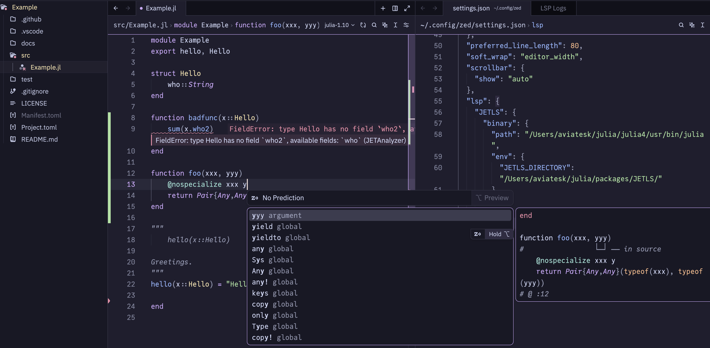

This codebase is a clone of [zed-julia](https://github.com/JuliaEditorSupport/zed-julia/).
Its purpose is to enable testing of the new Julia language server
[JETLS.jl](https://github.com/aviatesk/JETLS.jl) in the [Zed editor](https://zed.dev/).



By following the steps below, you can use JETLS within Zed:

### Requirements

- The latest version of [Zed](https://zed.dev/download)
- [Julia `v"1.12"`](https://julialang.org/downloads) or higher

### Steps

> [!warning]
> This extension does not bundle JETLS.jl itself. You need to
> install the `jetls` executable separately before using the extension.

- Install the [`jetls` executable app](https://pkgdocs.julialang.org/dev/apps/),
  which is the main entry point for running [JETLS.jl](https://github.com/aviatesk/JETLS.jl):
  ```bash
  julia -e 'using Pkg; Pkg.Apps.add(; url="https://github.com/aviatesk/JETLS.jl", rev="release")'
  ```
  This will install the `jetls` executable (or `jetls.exe` on Windows).
- Make sure the Julia apps directory `~/.julia/bin` is available on your `PATH`:
  You can verify the installation by running:
  ```bash
  jetls --help
  ```
  If this displays the help message, the installation was successful and `~/.julia/bin`
  is properly added to your `PATH`.
- Follow these [instructions](https://zed.dev/docs/extensions/developing-extensions#developing-an-extension-locally)
  to install the requirements for developing Zed extensions, particularly the Rust installation via rustup
- Clone [aviatesk/zed-julia](https://github.com/aviatesk/zed-julia) and check out to the `avi/JETLS` branch
- Open Zed and invoke the `zed: extensions` command
- Click `Install Dev Extension` and specify the directory of zed-julia

With the above setup, the zed-julia extension will use the installed `jetls` to analyze Julia files.

The `jetls` executable is run by default using the Julia executable that was used to install it.
Also note that the extension defaults to running `jetls` with `--threads=auto`.

If you want to use a different Julia executable to run `jetls`, change the `threads` option, or use a local JETLS checkout,
you will need to configure zed-julia with the following ways.

#### Optional Configuration

You can customize JETLS behavior in the `lsp` section of Zed settings:

- To specify different `--threads` option:
  ```jsonc
  "lsp": {
    "JETLS": {
      "binary": {
        "arguments": ["--threads=1", "--"]
      }
    }
  }
  ```

- The easiest way to use a different Julia executable is to use the
  [`JULIA_APPS_JULIA_CMD`](https://pkgdocs.julialang.org/dev/apps/#Overriding-the-Julia-Executable) environment variable:
  ```jsonc
  "lsp": {
    "JETLS": {
      "binary": {
        "env": {
          "JULIA_APPS_JULIA_CMD": "/path/to/specific/julia/executable"
        }
      }
    }
  }
  ```

- Using a local JETLS installation (for the development of JETLS itself):
  ```jsonc
  "lsp": {
    "JETLS": {
      "binary": {
        "path": "/path/to/specific/julia/executable",
        "arguments": [
          "--startup-file=no",
          "--history-file=no",
          "--threads=auto",
          "--project=/path/to/JETLS/directory",
          "-m",
          "JETLS"
        ]
      }
    }
  }
  ```

- Initialization options (settings applied at server startup):
  ```jsonc
  "lsp": {
    "JETLS": {
      "initialization_options": {
        // Number of concurrent analysis workers (default: 1)
        "n_analysis_workers": 3
      }
    }
  }
  ```
  Note: Changes to initialization options require restarting the language server.
  See the [JETLS documentation](https://aviatesk.github.io/JETLS.jl/release/launching/#init-options)
  for available options.

### Configuration

JETLS supports configuration through two methods:

#### Method 1: Project-specific configuration file

Create a `.JETLSConfig.toml` file in your project root, e.g.:
```toml
[full_analysis]
debounce = 2.0

# Use JuliaFormatter instead of Runic
formatter = "JuliaFormatter"

# Suppress unused argument warnings
[[diagnostic.patterns]]
pattern = "lowering/unused-argument"
match_by = "code"
match_type = "literal"
severity = "off"

[testrunner]
executable = "/path/to/custom/testrunner"
```

#### Method 2: Zed settings

Add configuration to your Zed `settings.json` under `lsp.JETLS.settings` section:

```jsonc
{
  "lsp": {
    "JETLS": {
      "settings": {
        "full_analysis": {
          "debounce": 2.0
        },
        // Use JuliaFormatter instead of Runic
        "formatter": "JuliaFormatter",
        // Suppress unused argument warnings
        "diagnostic": {
          "patterns": [
            {
              "pattern": "lowering/unused-argument",
              "match_by": "code",
              "match_type": "literal",
              "severity": "off"
            }
          ]
        },
        "testrunner": {
          "executable": "/path/to/custom/testrunner"
        }
      }
    }
  }
}
```

> [!note]
> `.JETLSConfig.toml` takes precedence over editor settings when both are present.

For complete configuration details,
see the [JETLS documentation](https://aviatesk.github.io/JETLS.jl/release/configuration/).

---

# Zed Julia

This extension adds support for the [Julia](https://julialang.org/) language in
the [zed](https://zed.dev) editor.

### Quick links

* [Contributing](./CONTRIBUTING.md)
* [Installing Julia / Zed / Zed Julia extension](#installing-julia--zed--zed-julia-extension)
* [Configuring the Julia executable for tasks](#configuring-the-julia-executable-for-tasks)
* [Running code in the REPL](#running-code-in-the-repl)
* [Using Zed in the REPL](#using-zed-in-the-repl)
* [Customizing syntax highlighting](#customizing-syntax-highlighting)

### Installing Julia / Zed / Zed Julia extension

1. Install Julia for your platform: https://julialang.org/downloads/
2. Install Zed for your platform: https://zed.dev/download
3. Start Zed.
4. Inside Zed, go to the extensions view by
executing the ``zed: extensions`` command (click Zed->Extensions).
5. In the extensions view, simply search for the term ``julia`` in the search box, then select the extension named ``Julia`` and click the install button. You might have to restart Zed after this step.

The Julia Zed extension looks for your Julia binary in the standard locations.
Make sure that the Julia binary is on your ``PATH``.

### Configuring the Julia executable for tasks

By default, Zed tasks (like running tests) use the `julia` command from your PATH.
You can customize which Julia executable is used by setting the `julia` environment variable:

1. **In your shell configuration** (`.bashrc`, `.zshrc`, etc.):
   ```bash
   export julia="/path/to/custom/julia"
   ```

2. **When launching Zed from the terminal**:
   ```bash
   julia="/path/to/custom/julia" zed .
   ```

3. **Using direnv** (automatically supported by Zed):
   - Create a `.envrc` file in your project root with:
     > .envrc
     ```
     JULIA_HOME="path/to/julia/directory"
     PATH_add "$JULIA_HOME/bin"
     export julia="$JULIA_HOME/bin/julia"
     ```
   - Run `direnv allow` to approve the file

This allows you to use different Julia versions for different projects or to
specify a Julia installation that's not on your PATH.

### Running code in the REPL

This section describes how to select Julia code in the editor and run it in Zed's integrated
terminal. This is more of a workaround than a full integration. Currently, there is no
_inline code execution_ as in VSCode. On the other hand, the Language Server is not required
to make this work.

1.  Open a .jl file in the editor.

2.  From the Command Palette, run `open in terminal`. This opens a new terminal in the
    worktree root (where the Project.toml lives). You can also right-click in the editor and
    use the context menu or press ``ctrl-shift-` `` as defined in the json example below.

3.  In the terminal, start the REPL with `julia --project`.

4.  Now it's time to select some code in the editor, copy it to the clipboard, paste it into
    the terminal, execute it, and go back to the editor. To make that less tedious, add one
    or more of the following key bindings. Change the `ctrl-shift-f10/11/12` combinations
    to your liking.

    Note: interacting with the terminal requires to send keystrokes. In the examples,
    `cmd-v` is used to paste code. Please adjust this binding for your operating system.

    ```jsonc
    // Zed key map file, usually ~/.config/zed/keymap.json
    [
      {
        // Set the focus back to the editor without hiding the terminal.
        // This is an auxiliary binding used by other bindings.
        "context": "Terminal",
        "bindings": { "ctrl-shift-`": "terminal_panel::ToggleFocus" }
      },
      {
        "context": "Editor && mode == full",
        "bindings": {
          // Open a new terminal and change to the worktree root directory.
          "ctrl-shift-`": "workspace::OpenInTerminal",

          // Execute the whole line the cursor is on and move the cursor to the next line.
          // Invoke this binding repeately to run line by line.
          "ctrl-shift-f10": [
            "action::Sequence",
            [
              "editor::SelectLine",
              "editor::Copy",
              "editor::MoveRight",
              ["workspace::SendKeystrokes", "ctrl-` cmd-v ctrl-shift-`"]
            ]
          ],

          // Execute the enclosing top level block e.g., a function definition.
          // Note the additional keystroke "enter" to actually execute the code.
          "ctrl-shift-f11": [
            "action::Sequence",
            [
              "editor::SelectEnclosingSymbol",
              "editor::CopyAndTrim",
              ["workspace::SendKeystrokes", "ctrl-` cmd-v enter ctrl-shift-`"]
            ]
          ],

          // Execute the paragraph (a block surrounded by blank lines).
          "ctrl-shift-f12": [
            "action::Sequence",
            [
              "editor::MoveToStartOfParagraph",
              "editor::SelectToEndOfParagraph",
              "editor::Copy",
              ["workspace::SendKeystrokes", "ctrl-` cmd-v ctrl-shift-`"]
            ]
          ]
        }
      }
    ]
    ```

### TestRunner integration (runnable standalone test tasks)

The Julia extension supports [TestRunner.jl](https://github.com/aviatesk/TestRunner.jl) for running individual tests, testsets, and test expressions directly from the editor. This provides a more granular testing experience compared to running the entire test suite with `Pkg.test()`.

> [!note] Note
> This integration requires Julia 1.12 or higher.

#### Installation

To use TestRunner.jl, install it globally as a Julia app:

```bash
julia -e 'using Pkg; Pkg.Apps.add("https://github.com/aviatesk/TestRunner.jl")'
```

This will install the `testrunner` [executable app](https://pkgdocs.julialang.org/dev/apps/). 
Make sure `~/.julia/bin` is available on the `PATH` environment so the `testrunner` executable is accessible.

**Note:** The Julia executable used for running tests can be configured as described in the [Configuring the Julia executable for tasks](#configuring-the-julia-executable-for-tasks) section above.

#### Features

TestRunner.jl integration provides several runnable tasks:

1. **Julia: Run test file (TestRunner.jl)** - Runs all tests in the current file
2. **Julia: Run `@testset` (TestRunner.jl)** - Runs a specific `@testset` block at the cursor position
4. **Julia: Run `# [TESTRUNNER]` comment expression (TestRunner.jl)** - Runs an expression following `# [TESTRUNNER]` comments
5. **Julia: Run expression at cursor (TestRunner.jl)** - Runs an expression at line of the current cursor position, useful for debugging arbitrary code including standalone `@test` cases (manual invocation only, experimental)

#### Usage

You can run tests in two ways:

1. **Using the play button** - Zed displays a play button (▶) in the gutter next to each `@testset` or any expression following comment starting `[TestRunner]`. Simply click the button to run that specific test.

<!-- TODO: Insert screenshot showing play buttons next to test cases -->

2. **Using the command palette** - Position your cursor on or inside the test element you want to run, then:
   - Use the command palette (<kbd>Cmd/Ctrl+Shift+P</kbd>) and search for "task: spawn"
   - Select the appropriate Julia test task from the list
   - The test will run in a new terminal with detailed output

Both methods will execute tests using TestRunner.jl with output shown in the terminal dock.

#### Example

```julia
using Test

test_func() = @test sin(x) == 0 # should fail

@testset "begin" begin
    println("foo")

    @test sin(0) == 0

    @testset let name = "bar",
                 v = π
        println(name)
        @test sin(v) == 0
    end

    @testset "some testset" include("some_test_file.jl")

    x = 3π/2
    # [TestRunner]
    test_func(x) # should fail
end

# [TESTRUNNER]
println("Debug output")  # Run with "Run [TESTRUNNER] expression"
```

<!-- TODO: Insert demo movie showing test execution -->

### Using Zed in the REPL

Zed is currently not on the list of Julia's predefined editors. You can add it to your `~/.julia/config/startup.jl`:

```julia
atreplinit() do repl
    InteractiveUtils.define_editor("zed") do cmd, path, line, column
        `$cmd $path:$line:$column`
    end
end
```

Set the environment variable EDITOR (or VISUAL or JULIA_EDITOR, whatever you use) to `zed --wait`. Then, using `InteractiveUtils.edit` etc. will open the document in Zed.

### Customizing syntax highlighting

You can change the foreground color and text attributes of syntax tokens in your `~/.config/zed/settings.json`, for instance:

```json
{
  "experimental.theme_overrides": {
    "syntax": {
      "comment.doc": {
        "font_style": "italic"
      },
      "function.definition": {
        "color": "#0000AA",
        "font_weight": 700
      }
    }
  }
}
```

See [Syntax Highlighting and Themes](https://zed.dev/docs/configuring-languages#syntax-highlighting-and-themes) and [Tree-sitter Queries](https://zed.dev/docs/extensions/languages#tree-sitter-queries) for further details.

Syntax tokens are called *captures* in tree-sitter jargon. The following table lists all captures provided by zed-julia. Some captures have default values (defined in [Zed's color themes](https://github.com/zed-industries/zed/blob/main/assets/themes/)) and the other captures fall back to one of the defaults. Depending on your color theme, some captures may be set to the editor's foreground color or to a very similar one. In this case, try to assign a different color to improve the contrast.

| Capture | Is there a default value? | Note/Example |
| ------- | ------------------------- | ------------ |
| `boolean` | yes |
| `comment` | yes | line or block comment |
| `comment.doc` | yes | docstring |
| `constant.builtin` | no, falls back to constant | core julia built-in |
| `function.builtin` | no, falls back to function | core julia built-in |
| `function.call` | no, falls back to function | name of the called function |
| `function.definition` | no, falls back to function | name of the defined function |
| `function.macro` | no, falls back to function | name of the macro |
| `keyword` | yes |
| `keyword.conditional` | no, falls back to keyword | `if`, `else` |
| `keyword.conditional.ternary` | no, falls back to keyword | `? :` |
| `keyword.exception` | no, falls back to keyword | `try`, `catch` |
| `keyword.function` | no, falls back to keyword | `function`, `do`, short function definition: `=` |
| `keyword.import` | no, falls back to keyword | `im/export`, `using`, module definition |
| `keyword.operator` | no, falls back to keyword | `in`, `isa`, `where` |
| `keyword.repeat` | no, falls back to keyword | `for`, `while` |
| `keyword.return` | no, falls back to keyword | `return` |
| `number` | yes |
| `number.float` | no, falls back to number |
| `operator` | yes |
| `punctuation.bracket` | yes | `()`, `[]`, `{}` |
| `punctuation.delimiter` | yes | `,`, `;` |
| `punctuation.special` | yes | string interpolation: `$()` |
| `string` | yes |
| `string.escape` | yes | escape sequence |
| `string.special` | yes | command literal |
| `string.special.symbol` | yes | quote expression |
| `type` | yes |
| `type.builtin` | no, falls back to type | core julia built-in |
| `type.definition` | no, falls back to type |
| `variable` | yes |
| `variable.builtin` | no, falls back to variable | core julia built-in: `begin` and `end` in indices |
| `variable.member` | no, falls back to variable | example: in `foo.bar`, the member is `bar` |

### Contributing

See [this document](./CONTRIBUTING.md).
